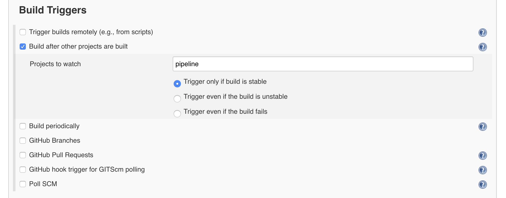

# Deployed Python REST API (Using Flask) on AWS ElasticBeanstalk as Docker Image using Jenkins CICD Pipeline Feature


### Steps involved in successful completion on high level

1. Need to have dockers knowledge and Docker installed on-prem
2. Need to expose your python code as a REST API using Flask
3. Create a Docker Image and run the container on-prem for REST API testing. (Can use docker-compose.yml to run more than 1 containers-- in this case it is "redis container" and "Python API Container" )
4. Need Redis (AWS ElasticCache) for in-memory storage --> used for caching. (For Production deployment)
5. Need to run Jenkins as a Docker Image and all the configuration done on that container. (For Production deployment)
6. Need a Github Repo which will be used to trigger the build in jenkins on successful code push to repo. (For Production deployment)
7. Need a Docker hub account in order to push the image to Docker hub on successful build. (For Production deployment)
8. Need AWS ElasticBeanstalk environment to be setup to deploy docker images and run container out of it. (For Production deployment)
9. Tested the final REST API Endpoint exposed by ElasticBeanstalk.
10. Successful end-end CICD pipeline


## Imp Step to expose the jenkins localhost for the webhooks integration, we used "ngrok"

https://dashboard.ngrok.com/get-started

After download we set the auth token 

./ngrok authtoken <Token>

Then we run the application to generate an http/https forwarding to localhost which can be used for webhooks

#### Sample Screenshot for the port forwarding


### Complete Configuration process

Run a Jenkins Container using the below Dockerfile and then update the permissions for
/var/run/docker.sock

### Dockerfile

`FROM jenkins/jenkins:lts
USER root
RUN apt-get update && \
apt-get -y install apt-transport-https \
    ca-certificates \
    curl \
    gnupg2 \
    software-properties-common && \
curl -fsSL https://download.docker.com/linux/$(. /etc/os-release; echo "$ID")/gpg > /tmp/dkey; apt-key add /tmp/dkey && \
add-apt-repository \
    "deb [arch=amd64] https://download.docker.com/linux/$(. /etc/os-release; echo "$ID") \
    $(lsb_release -cs) \
    stable" && \
apt-get update && \
apt-get -y install docker-ce
RUN apt-get install -y docker-ce
RUN usermod -a -G docker jenkins
USER jenkins`

#### Create the Jenkins Image 

`docker build -t kunwarluthera/jenkins-docker .`

#### Run the Jenkins Container with the command - 

`docker run --name jenkins-docker -p 8080:8080 -v /var/run/docker.sock:/var/run/docker.sock kunwarluthera/jenkins-docker:latest`

#### Enter the Jenkins Image and run below command to update privileges

`kunwarluthera$ docker exec -u root -it jenkins-docker /bin/bash`
`root@:/# `
`root@:/# cat /var/run/docker.sock`
`cat: /var/run/docker.sock: No such device or address`
`root@:/# ls -lad /var/run/docker.sock`
`srw-rw---- 1 root root 0 Mar 20 12:28 /var/run/docker.sock`
`root@:/# chmod 777 /var/run/docker.sock`


# Global Configuration Change


## Configure System Settings


### Docker hub configuration setting


### Docker URL setup 


<br>
<br>

### Github Pull Request 


### Elastic Beanstalk Configuration for deployment in ElasticBeanstalk


# Project Specific Changes 


1. pipeline 

#### pipeline Script mentioned

```JSON
pipeline {
  environment {
    registryCredential = 'dockerhub'
    dockerImage = ''
    dockerLatestTag = ''
  }
  agent any
  stages {
    stage('Cloning Git') {
      steps {
        git 'https://github.com/kunwarluthera/jenkins-python.git'
      }
    }
    stage('Building image') {
      steps{
        script {
          dockerImage = docker.build my_registry + ":$BUILD_NUMBER"
          dockerLatestTag = docker.build my_registry + ":latest"
        }
      }
    }
    stage('Deploy Image') {
  steps{
    script {
      docker.withRegistry( '', registryCredential ) {
        dockerImage.push()
        dockerLatestTag.push()
      }
    }
  }
}
stage('Remove Unused docker image') {
  steps{
    sh "docker rmi $my_registry:$BUILD_NUMBER"
    sh "docker rmi $my_registry:latest"
  }
}
  }
}
```


2. deployToElasticBeanstalk

### Source Code Management 


### Build Triggers



### Build


### Post Build Actions


### ElasticBeanstalk Security Group and Environment Variables setup 


### Redis Screenshot with Security Group Updated


### Final EB Environment setup and deployment successful 


### Setup Webhooks between Jenkins and Github.

used 'ngrok' to expose your localhost to the internet for the webhooks to work.

### Ex --> ./ngrok http 8080

## Create webhooks with the exposed jenkins URL created by 'ngrok'


