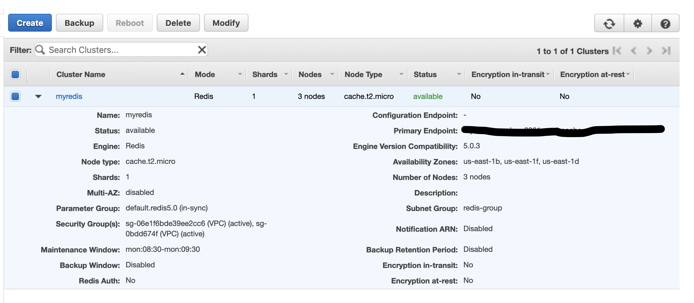

Sample Application

### Step-1

Run a Jenkins Container using the below Dockerfile and then update the permissions for
/var/run/docker.sock

### Dockerfile

FROM jenkins/jenkins:lts
USER root
RUN apt-get update && \
apt-get -y install apt-transport-https \
    ca-certificates \
    curl \
    gnupg2 \
    software-properties-common && \
curl -fsSL https://download.docker.com/linux/$(. /etc/os-release; echo "$ID")/gpg > /tmp/dkey; apt-key add /tmp/dkey && \
add-apt-repository \
    "deb [arch=amd64] https://download.docker.com/linux/$(. /etc/os-release; echo "$ID") \
    $(lsb_release -cs) \
    stable" && \
apt-get update && \
apt-get -y install docker-ce
RUN apt-get install -y docker-ce
RUN usermod -a -G docker jenkins
USER jenkins

Run the Jenkins Image with the command - 

Enter the Jenkins Image and run below command

Kunwars-MacBook-Pro:pythondemo kunwarluthera$ docker exec -u root -it jenkins-docker /bin/bash
root@7257c1de559b:/# 
root@7257c1de559b:/# cat /var/run/docker.sock
cat: /var/run/docker.sock: No such device or address
root@7257c1de559b:/# cat /var/run/
docker.sock  exim4/       lock/        utmp         
root@7257c1de559b:/# cat /var/run/docker.sock 
cat: /var/run/docker.sock: No such device or address
root@7257c1de559b:/# ls -lad /var/run/docker.sock
srw-rw---- 1 root root 0 Mar 20 12:28 /var/run/docker.sock
root@7257c1de559b:/# chmod 777 /var/run/docker.sock

# Global Configuration Change

## Configure System Settings

 
 

### Docker URL setup 

 
 

### Elastic Beanstalk Configuration for deployment in ElasticBeanstalk

# Project Specific Changes 

### Source Code Management 

### Build

### Post Build Actions

### ElasticBeanstalk Security Group and Environment Variables setup 

### Redis Screenshot with Security Group Updated

### Final EB Environment setup and deployment successful 

### Setup Webhooks between Jenkins and Github.

us 'ngrok' to expose your localhost to the internet for the webhooks to work.

### Ex --> ./ngrok http 8080

## Create webhooks with the exposed jenkins URL created by 'ngrok'

### Jenkins Project settings 

1. pipeline 

#### pipeline Script mentioned

`pipeline {
  environment {
    registryCredential = 'dockerhub'
    dockerImage = ''
    dockerLatestTag = ''
  }
  agent any
  stages {
    stage('Cloning Git') {
      steps {
        git 'https://github.com/kunwarluthera/simple-python-pyinstaller-app.git'
      }
    }
    stage('Building image') {
      steps{
        script {
          dockerImage = docker.build my_registry + ":$BUILD_NUMBER"
          dockerLatestTag = docker.build my_registry + ":latest"
        }
      }
    }
    stage('Deploy Image') {
  steps{
    script {
      docker.withRegistry( '', registryCredential ) {
        dockerImage.push()
        dockerLatestTag.push()
      }
    }
  }
}
stage('Remove Unused docker image') {
  steps{
    sh "docker rmi $my_registry:$BUILD_NUMBER"
  }
}
  }
}`